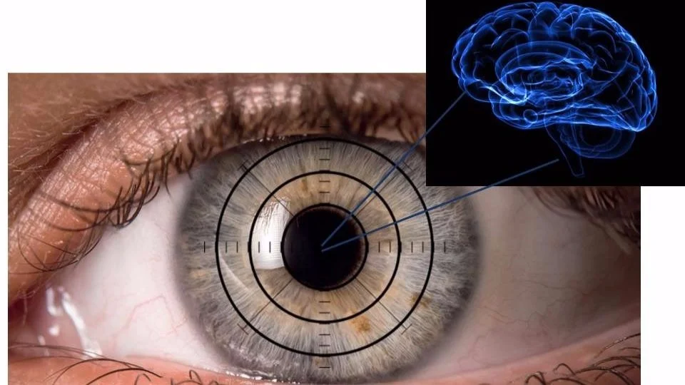

# Eye Focus Time Dataset for Alzheimer's Study

   

## Overview

The Eye Focus Time Dataset contains data collected from 32 patients (excluding 3 patients from the original cohort of 35) to study eye focus patterns and their relationship with Alzheimer's disease. Each patient performed 10 trials where their ability to maintain visual focus was measured in seconds. The dataset is labeled with a diagnosis of Alzheimer's (`1`) or Healthy (`0`), making it a valuable resource for educational purposes in the study of cognitive and visual attention.

---

## Dataset Details

- **Number of Patients**: 32
- **Number of Trials per Patient**: 10
- **Focus Time Range**: 2 to 10 seconds
- **Diagnosis**:
  - `1`: Alzheimer's
  - `0`: Healthy
- **Focus Time Pattern**: Each patient's focus times exhibit slight variations around a base value to reflect individual focus behavior.

---

## Purpose

This dataset is intended **for educational purposes only**. It provides a structured environment to study:
- The potential impact of Alzheimer's on visual focus.
- Patterns in eye focus times among individuals with or without Alzheimer's.
- Machine learning techniques for analyzing cognitive impairments using behavioral data.

---

## Usage

### Potential Applications
- Explore patterns in focus times to differentiate between Alzheimer's and Healthy groups.
- Develop predictive models for Alzheimer's detection based on eye focus data.
- Conduct statistical analyses to identify significant differences in visual focus times between groups.

### Recommended Analysis Steps
1. **Descriptive Statistics**: Analyze the mean, standard deviation, and range of focus times for each group.
2. **Visualizations**: Plot focus times across trials to observe trends and variations.
3. **Classification**: Use focus times as features to train machine learning models for Alzheimer's detection.
4. **Comparative Analysis**: Compare the performance of different models or statistical tests.

---

## Example Workflow
1. Load the dataset into Python or another data analysis tool.
2. Perform preprocessing (if needed) and visualize the focus time distributions.
3. Apply statistical tests (e.g., t-tests) to examine group differences.
4. Train machine learning models to classify Alzheimer's vs. Healthy based on focus time patterns.

